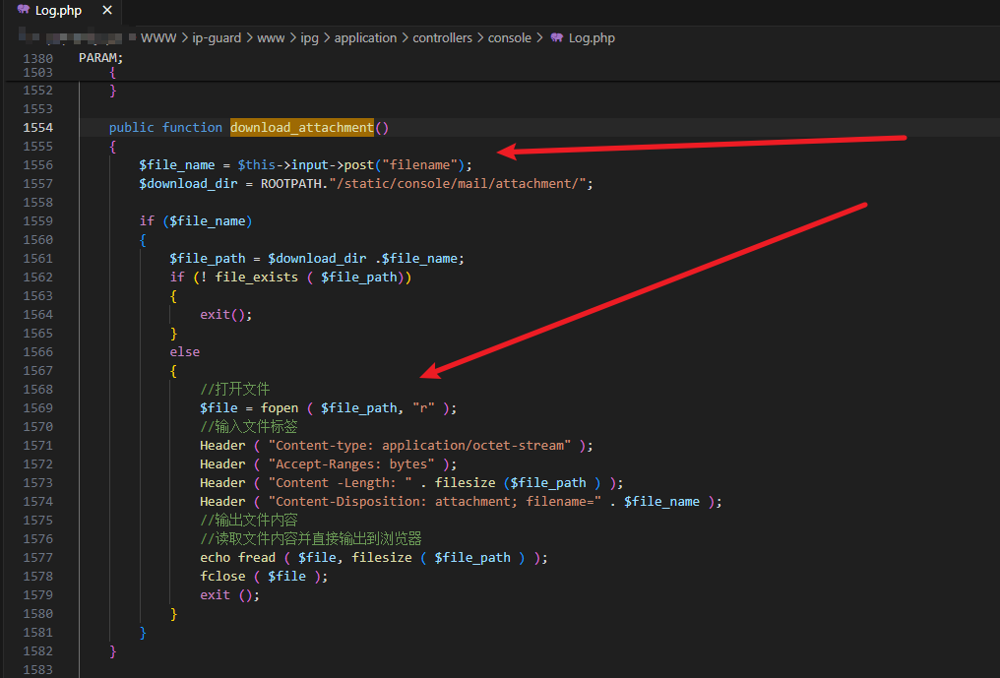
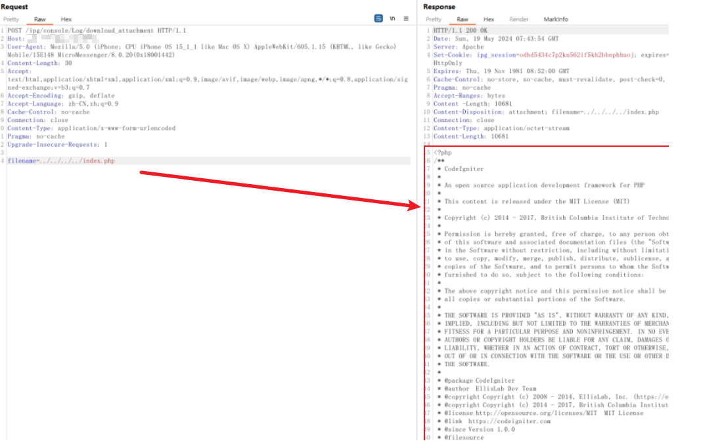

# Analysis

## Vulnerability analysis

We can see that the file name parameter in the download.attachment method is not directly filtered and can be read, thereby exploiting the vulnerability of arbitrary file reading

## Recurrence of vulnerabilities

